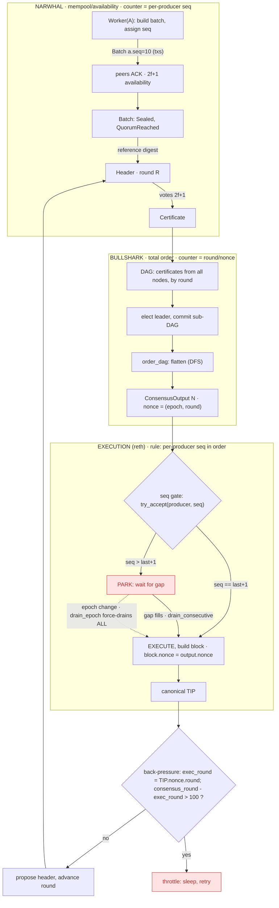
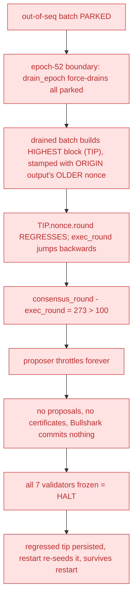
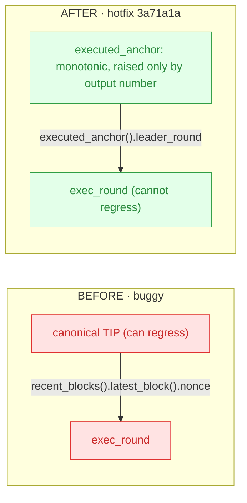

# Mainnet halt — 2026-06-21 — block pipeline & failure path

**One-line cause:** a drained out-of-sequence batch built the highest-numbered block (the tip) stamped with an **older** output `nonce`, so the proposer's execution watermark — read from the tip's nonce — **regressed** and throttled block production permanently. Triggered at the **epoch-52** boundary; survived restart because the regressed tip is persisted. Fixed by `3a71a1a` (monotonic "executed anchor").

---

## Two layers, two counters (keep these separate)

| Counter | Layer | Scope | Meaning |
|---|---|---|---|
| **`seq`** | Narwhal (mempool) | **per producer** | order a validator produced its own batches (`next_batch_seq`) |
| **`nonce` = (epoch, round)** | Bullshark → execution | **global total order** | which committed output a block came from (lower 32 bits = round) |

The bug was the **nonce** going backwards on the tip — *not* a `seq` problem. `seq` and `nonce` are different counters.

---

## Diagrams (Mermaid)

### Pipeline (happy path) — bug-prone nodes in red



### Failure path (epoch-52)



Observed: `consensus_round=50389, execution_round=50116, lag=273 vs threshold=100`; batch wedged `Sealed,QuorumReached`; `NoCertificateFetched` everywhere; "Epoch Task Manager shutdown cancelling tasks" at the boundary.

### The fix (`3a71a1a`)



---

## Key point

Out-of-order batches and **parking are normal, by-design** (DAG commit order ≠ per-producer
production order). The defect was one step later: a *drained* parked batch's block carried an
older `nonce` yet became the tip, and the proposer trusted the tip's nonce as the execution
frontier. Reading a **monotonic** anchor instead removes the regression.

---

## Evidence (file:line)

> Line numbers below are pinned to the pre-fix code **as it stood during this incident**
> (2026-06-21) — a forensic record, not a current pointer. Don't expect these to match
> `main` today; use the file paths to navigate and re-derive current line numbers if needed.

- `seq` assignment: `crates/consensus/worker/src/batch-builder/src/lib.rs:92,161,314`
- batch availability 2f+1 acks: `crates/consensus/worker/src/quorum_waiter.rs:150-153`
- parents = first 2f+1: `crates/consensus/primary/src/aggregators/certificates.rs:113`
- sub-DAG flatten: `crates/consensus/primary/src/consensus/utils.rs:10-54`
- per-producer seq gate / park: `crates/middleware/processor/src/batch/ordering.rs:76-104`
- epoch force-drain: `…/processor/src/execution/orchestrator.rs:255-280`, `…/batch/ordering.rs:189`
- proposer back-pressure (buggy): `crates/consensus/primary/src/proposer/run_loop.rs:116-133`; `EXECUTION_LAG_THRESHOLD=100` at `proposer/mod.rs:44`
- restart tip reseed: `crates/middleware/orchestrator/src/engine/node_inner.rs:286-291`
- fix: `3a71a1a` — `consensus_bus.rs` (`executed_anchor`), `proposer/run_loop.rs` (`execution_lag()`), `processor/src/lib.rs` (`send_if_modified`)
```
