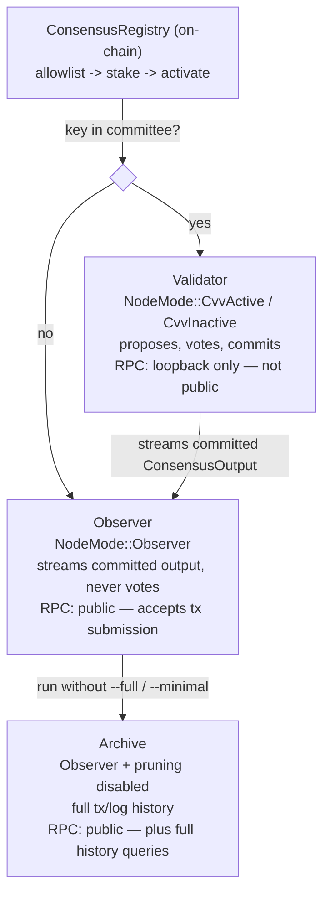

# Node types: Validator, Observer, Archive

This page answers "what are the deployable node types on Rayls mainnet, why does each
one matter, and how is each one configured?" — a stakeholder-facing counterpart to
[`glossary.md`](glossary.md#validator--observer--node) and
[`node-lifecycle.md`](node-lifecycle.md), which cover the same roles from a code/lifecycle
angle. Start here for "which node type do I need and why"; go to those two pages for "what
is this node doing right now."

## The short version

There is one binary, `rayls-network node` — every node type runs the same software.
What differs is **committee membership** (are this node's keys allowed to vote?) and
**operator configuration** (is state pruned? is the RPC port made public?):

| | Validator | Observer | Archive |
|---|---|---|---|
| In the on-chain committee? | Yes (allowlisted, staked, activated) | No | No |
| Votes / proposes in consensus? | Yes, while `CvvActive` | Never | Never |
| Same execution state as the others? | Yes | Yes | Yes |
| Prunes old state? | Operator's choice | Operator's choice | No — this is what makes it "Archive" |
| Intended RPC audience | Internal / not public | Public — accepts tx submissions | Public — plus full history queries |

The rest of this page grounds each row in the actual code, then covers each type in
detail.

## Architecture diagram

## Validator

**Role.** A node whose authority key has completed the on-chain join sequence —
allowlist → stake → activate (see [`node-lifecycle.md`](node-lifecycle.md), "Joining
the network — on-chain registration") — and is a current member of the committee.
While `NodeMode::CvvActive`
(`crates/consensus/primary/src/consensus_bus.rs:148`), it proposes headers, votes on
peers' headers, and participates in the Bullshark commit that produces the DAG's
totally-ordered output. A validator temporarily behind on sync runs as
`NodeMode::CvvInactive` — still a validator, just not currently voting
(`crates/consensus/primary/src/consensus_bus.rs:150`, and see
[`glossary.md#cvv-states-nodemode`](glossary.md#cvv-states-nodemode)).

**Why it's important.** Validators are the only node type whose votes count toward
BFT quorum. The DAG-BFT consensus (Narwhal/Bullshark) that produces Rayls' block order
and finality is only as live and safe as the set of currently-active validators —
without them, nothing commits.

**Configuration.**
- *Consensus participation*: full, when `CvvActive`. Gated independently in several
  places — `Certifier::spawn` requires `config.authority_id()` to be `Some`
  (`crates/consensus/primary/src/certifier.rs:82-87`); the Proposer is only
  constructed and only spawns when `is_active_cvv()`
  (`crates/consensus/primary/src/primary.rs:100-119`,
  `crates/consensus/primary/src/proposer/mod.rs:172-187`); the Bullshark commit loop
  itself only runs `if is_active_cvv()`
  (`crates/consensus/primary/src/consensus/state.rs:433-447`); and vote requests are
  rejected outright for any node with no `authority_id`
  (`crates/consensus/primary/src/network/handler.rs:634-644`).
- *State pruning*: not gated by node type in code at all — every node type takes the
  same `PruningArgs` (`--full`/`--minimal`, flattened into the `node` CLI via
  `crates/execution/evm/src/reth_env/config.rs:79-81`). Reference deployments in this
  repo run validators with `--full` (`etc/docker-network/compose.yaml:121`,
  `etc/validator/README.md:113-124`'s `activate-validator.sh --start`).
- *RPC exposure*: `RpcServerArgs::http_addr` defaults to loopback
  (`Ipv4Addr::LOCALHOST`) for every node type
  (`crates/execution/evm/src/rpc_server_args.rs:57-58`); `--http` itself defaults to
  `false` outside `--dev` mode (`:53-54`). Keeping a validator's RPC off the public
  path — so transactions can't be submitted directly through it — is an **operator
  convention enforced by not overriding the default and not exposing the port**, not a
  code-level restriction. (The bundled `etc/docker-network/` local test topology *does*
  bind validators publicly with `--http.addr 0.0.0.0` — that's a local-testing
  convenience, not the recommended production posture.)

**Why it matters for Rayls.** Validators are the trust root: their stake and BLS
signatures are what make the chain's history verifiable without trusting any single
party. Growing and geographically distributing the validator set is a decentralization
and liveness lever in a way the other two node types are not.

## Observer

**Role.** A node that is not in the committee — `NodeMode::Observer`, which the enum's
own doc comment describes as "follower not in the committee (staked or unstaked)"
(`crates/consensus/primary/src/consensus_bus.rs:151-152`). Committee membership, not
stake, is what makes a node an Observer (see
[`glossary.md#validator--observer--node`](glossary.md#validator--observer--node)). It
runs the identical `rayls-network node --observer` binary, holds the same execution
state as a validator, and follows consensus by streaming committed `ConsensusOutput`
from a peer instead of running the DAG itself
(`crates/middleware/bridge/src/subscriber.rs:130`,
[`doc/crates/middleware/overview.md`](crates/middleware/overview.md)).

**Why it's important.** An Observer decouples *read/write access to the network* from
*the ability to affect consensus*. A partner or integrator can run their own RPC entry
point — full control, no dependency on trusting someone else's endpoint — without being
handed any consensus power or needing to stake.

**Configuration.**
- *Consensus participation*: never votes or proposes — `is_observer()` is the exact
  inverse of committee membership (`crates/consensus/primary/src/consensus_bus.rs:167-169`).
  It does, however, still run the Worker's batch builder
  (`NodeMode::is_batch_producing()` is true for `CvvActive | Observer`, deliberately
  excluding the catching-up `CvvInactive` —
  `crates/consensus/primary/src/consensus_bus.rs:176-178`), so transactions submitted
  to an Observer's RPC are sealed into batches and gossiped into the network for a
  validator's Primary to eventually reference.
- *State pruning*: same `PruningArgs` CLI surface as a Validator — code does not
  special-case Observers. The reference runbook happens to pass `--full`
  (`etc/observer/README.md:178-190`), but that is an operator choice, not a
  requirement.
- *RPC exposure*: same loopback default as any node type, but the intended posture is
  the opposite of a Validator's — Observers are meant to be the public-facing entry
  point for transaction submission and general RPC traffic
  (`etc/observer/README.md:1-5`: "serves RPC traffic but does not participate in block
  production").

**Why it matters for Rayls.** Observers let the network scale RPC/read capacity and
give partners operational independence, without growing the trust-sensitive validator
set. Key generation for an Observer produces literally the same key material as a
Validator (`crates/infrastructure/network-cli/src/keytool/mod.rs:79-89` routes both
`NodeType::ValidatorKeys` and `NodeType::ObserverKeys` through the same `KeygenArgs`
code path) — the BLS key exists so the Observer can authenticate its own p2p gossip
(e.g. forwarding user-submitted transactions toward a validator), not to vote
(`etc/observer/README.md`, cross-referenced in
[`glossary.md#validator--observer--node`](glossary.md#validator--observer--node)).

## Archive

**Role.** There is no `NodeMode::Archive` and no dedicated CLI flag — "Archive" is an
Observer run **without** a pruning flag (`--full`/`--minimal`). The clearest evidence
this is the intended reading is the doc comment on `RethEnv::new_for_archive_replay`
(used by the offline `rayls-replay` tool, not a live node, but describing the same
underlying mechanism): *"Pruning is DISABLED (default `NodeConfig::default()` has
`prune_config() == None`), producing a full archive"*
(`crates/execution/evm/src/reth_env/init.rs:186-192`). For a live node, the same
absence-of-a-pruning-flag path applies:
`spawn_persistence` falls back to a no-op pruner — zero prune segments,
`usize::MAX` interval, `0` delete limit — whenever no `PruneConfig` is supplied
(`crates/execution/evm/src/persistence.rs:27-45`). **This page is the first place that
names "Archive" as a distinct node type** — there is no prior doc or code convention to
defer to here, and it is a synthesis from the pruning wiring above, not a pre-existing
named feature.

**Why it's important.** Both Validators and Observers prune old state on an operator's
schedule; once a block is pruned, it can't be replayed and its transaction logs are no
longer retrievable. Anything that needs full historical queries — most notably DeFi
protocols indexing past events, block explorers, and compliance/audit tooling — needs a
node that never prunes.

**Configuration.**
- *Consensus participation*: identical to Observer — it is an Observer.
- *State pruning*: none. Run `rayls-network node --observer` (all the same flags an
  Observer would use) and simply omit `--full`/`--minimal`.
- *RPC exposure*: same as Observer, typically the most public-facing of the three since
  it's also the one serving deep historical queries.

**Why it matters for Rayls.** Archive nodes are what lets Rayls support DeFi
integrations and analytics without asking every consumer of historical data to run
their own full sync from genesis, or asking every Validator/Observer to pay the
storage cost of never pruning. An Observer can act as an Archive node at the same
time — the two are not mutually exclusive; "Archive" describes a pruning
configuration, not a separate deployment.

## Open questions

- **Per-node machine sizing / cost** — not covered here; needs SRE input before this
  page (or its Notion/Confluence copy) is treated as complete guidance for
  provisioning. Tracked as an open item on
  [raylsnetwork/axyl#48](https://github.com/raylsnetwork/axyl/issues/48).

## See also

- [`glossary.md`](glossary.md#validator--observer--node) — precise Validator/Observer
  definitions and the `NodeMode` states table.
- [`node-lifecycle.md`](node-lifecycle.md) — the full operational lifecycle (install →
  keygen → on-chain join → sync → steady state → epoch transitions → shutdown → crash
  recovery), which applies to Validators and Observers alike.
- [`index.md`](index.md) — system-wide architecture diagram and RPC interface tables.
- [`../etc/validator/README.md`](../etc/validator/README.md) — validator provisioning
  runbook.
- [`../etc/observer/README.md`](../etc/observer/README.md) — observer provisioning
  runbook.
